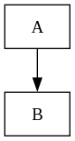

* infra
#+begin_src plantuml :file test.png :exports results
  :start;

  if (setup?) then (yes)
  else (no)
          while (dev certificates exist?) is (no)
                  :create certificates;
                  :add certificates;
          endwhile (yes)
  endif

  :end;
#+end_src

#+RESULTS:

** AI generated example setup
infra/
├── .forgejo/
│   └── workflows/
│       └── drift-detect.yml        # schedule: cron -> plan -> open PR (per tier)
├── atlantis.yaml                    # per-project apply_requirements
├── modules/
│   ├── ca-root/
│   ├── ca-intermediate/
│   ├── leaf-cert/
│   ├── leaf-mikrotik/
│   └── ca-crl/
└── live/
    ├── terragrunt.hcl               # root: backend config (local now, S3/MinIO later)
    ├── ca-root/                     # 🔒 human-approved only, prevent_destroy
    ├── ca-services/                 # 🔒 human-approved only
    │   ├── leaf-mikrotik/           # ⚙️ auto-apply (routeros provider)
    │   └── leaf-matchbox/           # ⚙️ auto-apply (mTLS pair)
    ├── ca-kubernetes/                # 🔒 human-approved only
    │   └── leaf-etcd-apiserver/     # ⚙️ auto-apply
    ├── matchbox/                     # profiles/Ignition configs
    └── ca-crl/                       # revoked-serials list -> CRL, pushed to Mikrotik
